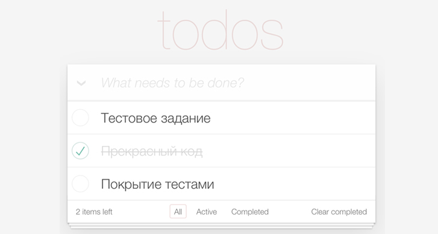
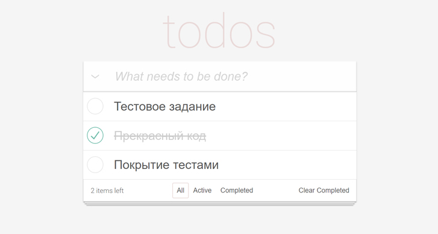

# Тестовое задание для Frontend intern в Mindbox

Необходимо сделать ToDo-приложение, позволяющее управлять текущим списком дел.

- [Исходные данные](#исходные-данные)
- [Требования к коду](#требования-к-коду)
- [Полученный результат](#полученный-результат)
- [Stack](#stack)
- [Запуск проект](#запуск-проект)

## Исходные данные

В интерфейсе должно быть:
 - Поле для ввода новой задачи
 - Списки всех задач, невыполненных и выполненных задач (по отдельности)

Дан **скрин экрана** с примерным внешним видом приложения:



## Требования к коду

 - Приложение создано с использованием TypeScript, React и React Hooks
 - Библиотеки компонент – на ваше усмотрение
 - Ключевая на ваш взгляд функциональность обязательно покрыта тестами
 - Проект должен запускаться командой npm i && npm run start
 - Опционально: проект доступен на GitHub Pages/Vercel/etc

## Полученный результат

**Реализована вся необходимая функциональность.**

**Учтены неуказанные в ТЗ  моменты:**
 - при добавлении более 3-х todo добавляется скролл для todo-list;
 - текст незавершенных todo можно редактировать;

**Написаты тесты.**



## Stack
HTML, CSS, JavaScript, React, TypeScript, Redux Tooklit, Testing Library, Redux Mock Store

## Запуск проект

Необходима установка [Node.js](https://nodejs.org/en).

Установите завистимости:
```sh
npm i
```

Запустите приложение командой:
```sh
npm run start
```
